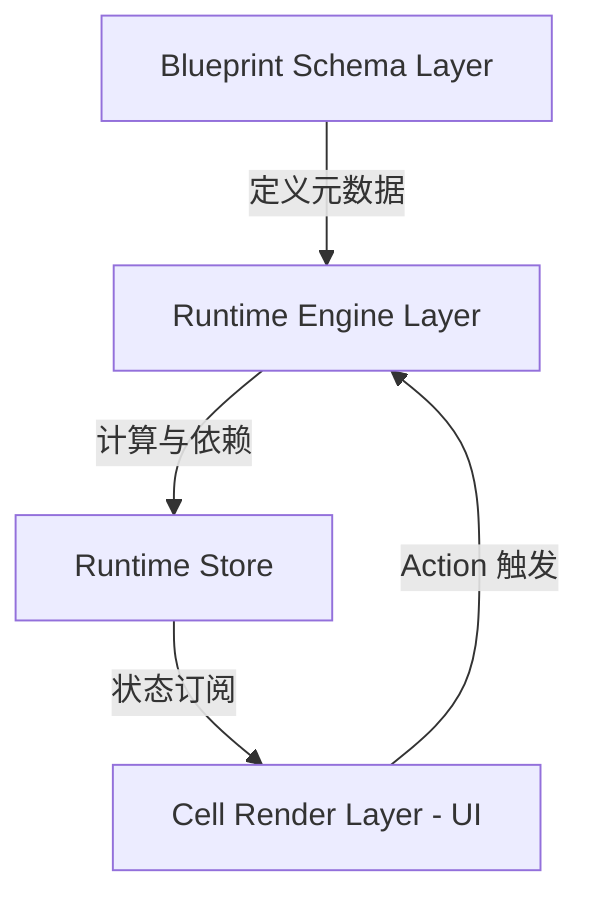

# formx

**Headless 计算内核，驱动多端业务逻辑**

> 专业级表单 / Cell Runtime 引擎。不仅仅是表单库，而是账务交互与计算执行层 Runtime。 Powered by @enginx.

[📖 在线文档](https://holdtec.github.io/formX/) | [📦 GitHub 仓库](https://github.com/holdtec/formX.git)

## 🚀 项目定位

formx 是一个 **Schema 驱动**、**可插拔**、**框架无关** 的复杂表单运行时引擎。旨在解决企业级应用（ERP, CRM, WMS）中复杂的字段联动、嵌套数据计算（如明细表）、多端逻辑复用等痛点。

它将表单视为一个 **“计算问题”** 而非单纯的 “渲染问题”。

## 🌟 核心特性

*   **Headless (无头架构)**: 核心逻辑不依赖 React/Vue，一套内核驱动 Web、Mobile、小程序多端。
*   **Schema Driven (配置驱动)**: 通过 JSON 声明字段、布局、行为和计算逻辑。
*   **Smart Computation (智能计算)**: 内置 DAG (有向无环图) 依赖追踪，自动处理 `A = B + C` 类型的联动。
*   **Safe Mode (安全模式)**: **默认开启**。内置递归下降解析器，不使用 `eval` 或 `new Function`，完美兼容微信小程序及 CSP 环境。
*   **Robustness (稳健性)**: 内置死循环检测、最大递归深度熔断 (Recursion Guard) 和浮点数震荡保护 (Epsilon Check)。
*   **High Performance (高性能)**: 精确更新机制，仅重算受影响的节点，轻松支撑 1000+ 行明细数据。
*   **Card Model (卡片模型)**: 专为复杂的嵌套数据结构设计，支持 List -> Card -> Section -> Fields 的层级。
*   **Framework Agnostic**: 核心库零依赖，适配层可对接 Zustand, Redux, Pinia 等。

## 📦 安装

```bash
# 使用 npm
npm install @enginx/formx-core

# 使用 yarn
yarn add @enginx/formx-core

# 使用 pnpm
pnpm add @enginx/formx-core
```

## 🏗 架构设计



1.  **Schema Layer**: 纯 JSON 配置，定义字段类型、验证规则、计算表达式 (`expression`)。
2.  **Runtime Engine**: 负责解析 Schema，构建依赖图，执行计算，管理生命周期。
3.  **Store Adapter**: 状态容器接口，可适配各种状态管理库。
4.  **UI Layer**: 哑组件 (Dumb Components)，只负责渲染和用户交互，不包含业务逻辑。

## 📦 目录结构

```
.
├── lib/
│   ├── core.ts       # 核心运行时引擎 (DAG, Safe Eval, Cycle Check)
│   ├── graph.ts      # 依赖图算法
│   ├── store.ts      # 状态管理适配器 (Vanilla/Zustand 实现)
│   └── ...
├── types.ts          # TypeScript 类型定义 (Schema, Runtime)
├── App.tsx           # 演示应用 & 文档
├── index.tsx         # 入口文件
└── ...
```

## 🎯 适用场景

**推荐使用 Formx：**
- 复杂 B 端单据（字段 > 50，嵌套表格，跨字段联动）
- 多端业务统一（Web / App / 小程序逻辑一致）
- 低代码/配置化平台（后端下发 JSON 动态渲染）
- 财务/计费系统（金额计算、汇率转换、合计汇总）

**建议使用其他方案：**
- 简单登录/注册页（2-3 个字段）→ React Hook Form
- 重度 UI 定制（动画为主，逻辑简单）→ 原生表单

👉 [查看完整技术选型对比](https://holdtec.github.io/formX/)

## ⚡️ 快速开始

### 1. 定义 Schema

```typescript
const schema = [
  { key: 'price', type: 'NUMBER', label: '单价' },
  { key: 'quantity', type: 'NUMBER', label: '数量' },
  { 
    key: 'total', 
    type: 'MONETARY', 
    label: '总价',
    read_only: true,
    expression: 'price * quantity' // 自动联动计算 (Safe Mode)
  }
];
```

### 2. 初始化引擎

```typescript
import { createRuntime, createVanillaStore } from '@enginx/formx-core';

const store = createVanillaStore({ price: 10, quantity: 2, total: 20 });
const engine = createRuntime({ schema, store });
```

### 3. UI 绑定 (React 示例)

```tsx
// 组件内订阅 Store
const price = useSyncExternalStore(
  (cb) => engine.getStore().subscribe(cb), 
  () => engine.getStore().getState().price
);

// 触发更新
<input 
  value={price} 
  onChange={e => engine.setValue('price', parseFloat(e.target.value))} 
/>
```

## 🛡 安全与稳定性

为了在生产环境中提供极高的可靠性，Formx 内置了多重防护机制：

1.  **Safe Evaluation (Shunting-yard 算法)**: 抛弃 `new Function`，使用 Shunting-yard 算法将中缀表达式转为后缀表达式（RPN）执行。
    *   ✅ 兼容微信小程序
    *   ✅ 兼容严格 CSP 策略
    *   ✅ 防止任意代码执行攻击
    *   ✅ 无死循环风险
2.  **Cycle Detection**: 启动时自动检测 Schema 中的循环依赖 (A -> B -> A)，并输出警告。
3.  **Recursion Guard**: 运行时检测递归深度，超过阈值（默认 50 层）自动熔断，防止浏览器卡死。
4.  **Epsilon Check**: 针对 JavaScript 浮点数精度问题（0.1 + 0.2 !== 0.3）进行容差处理，防止震荡更新。
5.  **Invalid Value Handling**: 自动处理无效值，`null`、`NaN`、`undefined`、`"NA"` 等均安全转换为 `0`，不会导致计算错误。

## 🧮 表达式引擎

Formx v2.0 采用 **Shunting-yard 算法** 实现表达式解析，支持丰富的运算符和函数：

### 支持的运算符

| 类型 | 运算符 | 示例 |
|------|--------|------|
| 算术运算 | `+ - * / % ^` | `price * quantity` |
| 比较运算 | `> < >= <= == !=` | `amount > 1000` |
| 逻辑运算 | `&& \|\| !` | `a > 0 && b > 0` |

### 支持的函数

| 函数 | 说明 | 示例 |
|------|------|------|
| `Math.pow(a, b)` | 幂运算 | `Math.pow(1.05, years)` |
| `Math.round(x)` | 四舍五入 | `Math.round(total)` |
| `Math.floor(x)` | 向下取整 | `Math.floor(price)` |
| `Math.ceil(x)` | 向上取整 | `Math.ceil(ratio)` |
| `Math.abs(x)` | 绝对值 | `Math.abs(diff)` |
| `Math.max(a, b)` | 最大值 | `Math.max(a, b)` |
| `Math.min(a, b)` | 最小值 | `Math.min(a, b)` |
| `IF(cond, t, f)` | 条件函数 | `IF(level == "VIP", 0.8, 1)` |
| `SUM(list.field)` | 聚合求和 | `SUM(items.amount)` |

### 表达式示例

```typescript
// 基础计算
expression: 'price * quantity'

// 复利计算
expression: 'principal * Math.pow(1 + rate/100, years)'

// 条件折扣
expression: 'IF(amount > 10000, amount * 0.9, amount)'

// 多级条件
expression: 'IF(level == "gold", 20, IF(level == "silver", 10, 5))'

// 逻辑组合
expression: 'IF(age >= 18 && income > 5000, 1, 0)'

// 聚合计算
expression: 'SUM(items.amount)'
```

## 🛠 开发计划

- [x] **Phase 1: 核心内核** - Schema 定义, 基础 Store 接口, 简单联动.
- [x] **Phase 2: 计算引擎** - 完整 DAG 算法, Safe Eval 解析器, 循环依赖检测, 聚合计算(SUM).
- [ ] **Phase 3: 高级 UI** - 虚拟滚动, 复杂嵌套表格, 维度选择器.
- [ ] **Phase 4: 生态扩展** - 插件系统, 远程函数注入.

## 📄 License

MIT