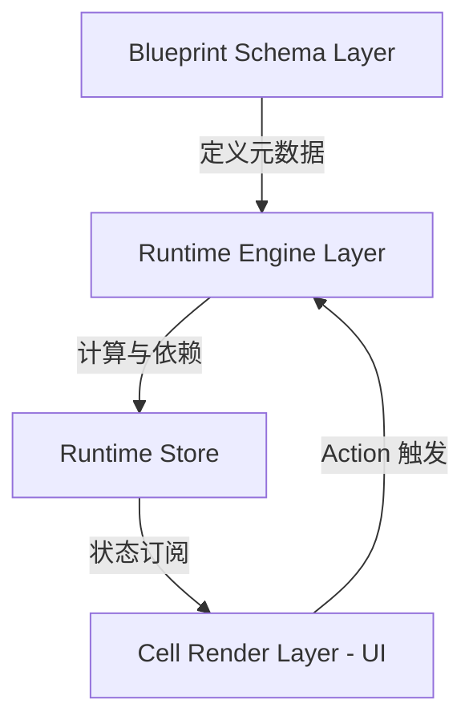

# formx

**Headless 计算内核，驱动多端业务逻辑**

> 专业级表单 / Cell Runtime 引擎。不仅仅是表单库，而是账务交互与计算执行层 Runtime。 Powered by @enginx.

## 🚀 项目定位

formx 是一个 **Schema 驱动**、**可插拔**、**框架无关** 的复杂表单运行时引擎。旨在解决企业级应用（ERP, CRM, WMS）中复杂的字段联动、嵌套数据计算（如明细表）、多端逻辑复用等痛点。

它将表单视为一个 **“计算问题”** 而非单纯的 “渲染问题”。

## 🌟 核心特性

*   **Headless (无头架构)**: 核心逻辑不依赖 React/Vue，一套内核驱动 Web、Mobile、小程序多端。
*   **Schema Driven (配置驱动)**: 通过 JSON 声明字段、布局、行为和计算逻辑。
*   **Smart Computation (智能计算)**: 内置 DAG (有向无环图) 依赖追踪，自动处理 `A = B + C` 类型的联动，防止循环依赖。
*   **High Performance (高性能)**: 精确更新机制，仅重算受影响的节点，轻松支撑 1000+ 行明细数据。
*   **Card Model (卡片模型)**: 专为复杂的嵌套数据结构设计，支持 List -> Card -> Section -> Fields 的层级。
*   **Framework Agnostic**: 核心库零依赖，适配层可对接 Zustand, Redux, Pinia 等。

## 🏗 架构设计



1.  **Schema Layer**: 纯 JSON 配置，定义字段类型、验证规则、计算表达式 (`expression`)。
2.  **Runtime Engine**: 负责解析 Schema，构建依赖图，执行计算，管理生命周期。
3.  **Store Adapter**: 状态容器接口，可适配各种状态管理库。
4.  **UI Layer**: 哑组件 (Dumb Components)，只负责渲染和用户交互，不包含业务逻辑。

## 📦 目录结构

```
.
├── lib/
│   ├── core.ts       # 核心运行时引擎 (依赖追踪、计算逻辑)
│   ├── store.ts      # 状态管理适配器 (Vanilla/Zustand 实现)
│   └── ...
├── types.ts          # TypeScript 类型定义 (Schema, Runtime)
├── App.tsx           # 演示应用 & 文档
├── index.tsx         # 入口文件
└── ...
```

## ⚡️ 快速开始

### 1. 定义 Schema

```typescript
const schema = [
  { key: 'price', type: 'NUMBER', label: '单价' },
  { key: 'quantity', type: 'NUMBER', label: '数量' },
  { 
    key: 'total', 
    type: 'MONETARY', 
    label: '总价',
    read_only: true,
    expression: 'price * quantity' // 自动联动计算
  }
];
```

### 2. 初始化引擎

```typescript
import { createRuntime, createVanillaStore } from '@enginx/formx-core';

const store = createVanillaStore({ price: 10, quantity: 2, total: 20 });
const engine = createRuntime({ schema, store });
```

### 3. UI 绑定 (React 示例)

```tsx
// 组件内订阅 Store
const price = useSyncExternalStore(
  (cb) => engine.getStore().subscribe(cb), 
  () => engine.getStore().getState().price
);

// 触发更新
<input 
  value={price} 
  onChange={e => engine.setValue('price', parseFloat(e.target.value))} 
/>
```

## 🛠 开发计划

- [x] **Phase 1: 核心内核** - Schema 定义, 基础 Store 接口, 简单联动.
- [ ] **Phase 2: 计算引擎** - 完整 DAG 算法, AST 表达式解析, 循环依赖检测.
- [ ] **Phase 3: 高级 UI** - 虚拟滚动, 复杂嵌套表格, 维度选择器.
- [ ] **Phase 4: 生态扩展** - 插件系统, 远程函数注入.

## 📄 License

MIT